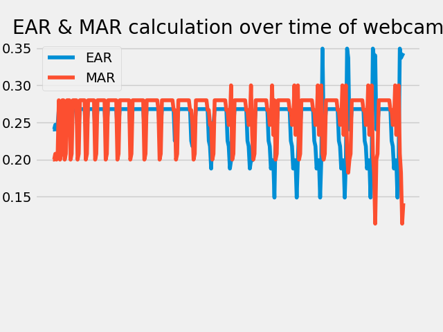
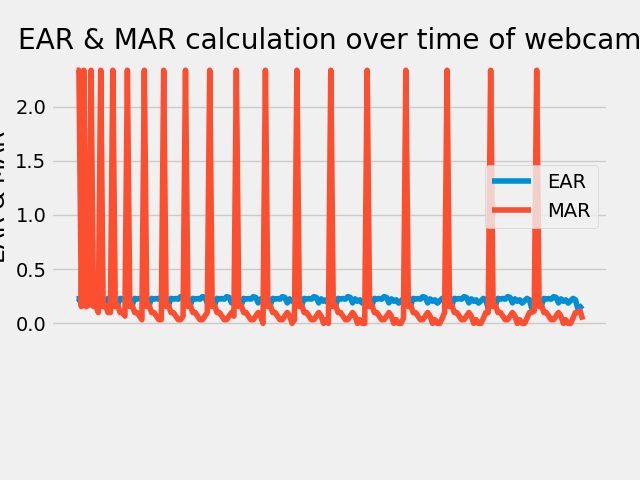

# 🚗 Driver Drowsiness Detection

A Flask web interface for a driver drowsiness detector using OpenCV, dlib facial landmarks, eye aspect ratio (EAR), and mouth aspect ratio (MAR).



> ⚠️ This project is for learning and experimentation. It should not be used as the only safety system while driving.

## 🧰 Requirements

- Windows with Python 3.10 or newer
- A working webcam
- The file `shape_predictor_68_face_landmarks.dat` in the project root

## ▶️ Run locally

From the project folder, install the dependencies:

```powershell
python -m pip install -r requirements.txt
python -m pip install dlib gunicorn
```

Start the Flask application:

```powershell
python app1.py
```

Open http://127.0.0.1:5000 in a browser.

Select **Continue**, then **Start**. The webcam detector opens in a separate OpenCV window named `Output`. Press `q` in that window to stop detection.

## 📊 Results

The detector records eye and mouth measurements from webcam frames for later review:

| EAR and MAR over time | Alternate measurement view |
| --- | --- |
|  |  |

## 📁 Project files

- `app1.py` - Flask web application
- `drowsiness_detection.py` - webcam detection and alert logic
- `EAR_calculator.py` - eye and mouth ratio calculations
- `templates/` and `static/` - web interface files
- `shape_predictor_68_face_landmarks.dat` - dlib facial landmark model

## ⬆️ GitHub updates

After changing files locally:

```powershell
git add .
git commit -m "Describe your change"
git push
```

Repository: https://github.com/chayagp80-cmyk/driver-drowsiness-detection

## 🌐 Deployment note

GitHub stores the source code but GitHub Pages cannot run this Flask/Python application or access a user's webcam. A Python hosting service is required for the Flask web interface. The current detector uses a local webcam and desktop OpenCV window, so it is intended to run locally unless the camera workflow is rewritten for browser video.
